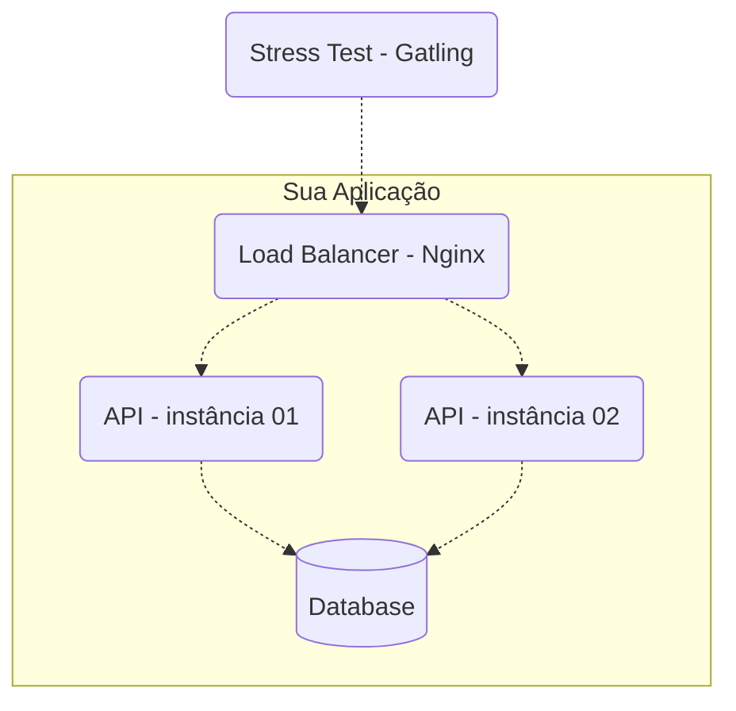

# Instruções e Regras para Rinha de Backend - Edição 2023 Q3

- As APIs precisam expor endpoints iguais e necessariamente usar um dos seguintes bancos de dados (à sua escolha): Postgres, MySQL, ou MongoDB.
- O "deploy" da API seria feito via docker-compose com limites de CPU e memória.
- O teste seria executado no meu note mesmo (por isso a limitação de CPU e memória) com a ferramenta [Gatling](https://gatling.io/).
- O torneio terá duas categorias: linguagens interpretadas e compiladas.
- A essência desse torneio não é a competição em si (até mesmo pq não ganha nada quem vencer kkk), mas compartilhar conhecimento.


## Endpoints
As APIs precisam expor 3 endpoints:

- `POST /pessoas` – para criar um recurso pessoa.
- `GET /pessoas/[:id]` – para consultar um recurso criado com a requisição anterior.
- `GET /pessoas?t=[:termo da busca]` – para fazer uma busca por pessoas.
- `GET /contagem-pessoas` – endpoint especial para contagem de pessoas cadastradas.


### Criação de Pessoas
`POST /pessoas`

Deverá aceitar uma requisição em formato JSON com os seguintes parâmetros:

| atributo | descrição |
| --- | --- |
| **apelido** | obrigatório, único, string de até 32 caracteres. |
| **nome** | obrigatório, string de até 100 caracteres. |
| **nascimento** | obrigatório, string para data no formato AAAA-MM-DD (ano, mês, dia). |
| **stack** | opcional, vetor de string com cada elemento sendo obrigatório e de até 32 caracteres. |

Para requisições válidas, sua API deverá retornar status code 201 - created junto com o header "Location: /pessoas/[:id]" onde [:id] é o id – em formato UUID com a versão a seu critério – da pessoa que acabou de ser criada. O conteúdo do corpo fica a seu critério; retorne o que quiser. 

Exemplos de requisições válidas:
```json
{
    "apelido" : "josé",
    "nome" : "José Roberto",
    "nascimento" : "2000-10-01",
    "stack" : ["C#", "Node", "Oracle"]
}
```

```json
{
    "apelido" : "ana",
    "nome" : "Ana Barbosa",
    "nascimento" : "1985-09-23",
    "stack" : null
}
```
Para requisições inválidas, o status code deve ser 422 - Unprocessable Entity/Content. Aqui, novamente, o conteúdo do corpo fica a seu critério.

Exemplos de requisições válidas:
```json
{
    "apelido" : "josé", // caso "josé" já tenha sido criado em outra requisição
    "nome" : "José Roberto",
    "nascimento" : "2000-10-01",
    "stack" : ["C#", "Node", "Oracle"]
}
```

```json
{
    "apelido" : "ana",
    "nome" : null, // não poder ser null
    "nascimento" : "1985-09-23",
    "stack" : null
}
```

```json
{
    "apelido" : null, // não pode ser null
    "nome" : "Ana Barbosa",
    "nascimento" : "23-09-1985", // formato inválido
    "stack" : null
}
```

### Detalhe de uma Pessoa
`GET /pessoas/[:id]`

Deverá retornar os detalhes de uma pessoa caso esta tenha sido criada anteriormente. O parâmetro [:id] deve ser do tipo UUID na versão que escolher. O retorno deve ser como os exemplos a seguir.


```json
{
    "id" : "f7379ae8-8f9b-4cd5-8221-51efe19e721b",
    "apelido" : "josé",
    "nome" : "José Roberto",
    "nascimento" : "2000-10-01",
    "stack" : ["C#", "Node", "Oracle"]
}
```

```json
{
    "id" : "5ce4668c-4710-4cfb-ae5f-38988d6d49cb",
    "apelido" : "ana",
    "nome" : "Ana Barbosa",
    "nascimento" : "1985-09-23",
    "stack" : null
}
```

Note que a resposta é praticamente igual ao payload de criação com o acréscimo do ID. O status code para pessoas que existem deve ser 200 - Ok. Para recursos que não existem, deve-se retornar 404 - Not Found.


### Busca de Pessoas
`GET /pessoas?t=[:termo da busca]`

Dado o `termo da busca`, a resposta deverá ser uma lista que satisfaça o termo informado estar contido nos atributos `apelido`, `nome`, e/ou elementos de `stack`. A busca não precisa ser paginada e poderá retornar apenas os 50 primeiros registros resultantes da filtragem.

O status code deverá ser sempre 200 - Ok, mesmo para o caso da busca não retornar qualquer resultado.

Exemplos: Dado os recursos seguintes existentes em sua aplicação:

```json
[{
    "id" : "f7379ae8-8f9b-4cd5-8221-51efe19e721b",
    "apelido" : "josé",
    "nome" : "José Roberto",
    "nascimento" : "2000-10-01",
    "stack" : ["C#", "Node", "Oracle"]
},
{
    "id" : "5ce4668c-4710-4cfb-ae5f-38988d6d49cb",
    "apelido" : "ana",
    "nome" : "Ana Barbosa",
    "nascimento" : "1985-09-23",
    "stack" : ["Node", "Postgres"]
}]
```

Uma requisição `GET /pessoas?t=node`, deveria retornar o seguinte:
```json
[{
    "id" : "f7379ae8-8f9b-4cd5-8221-51efe19e721b",
    "apelido" : "josé",
    "nome" : "José Roberto",
    "nascimento" : "2000-10-01",
    "stack" : ["C#", "Node", "Oracle"]
},
{
    "id" : "5ce4668c-4710-4cfb-ae5f-38988d6d49cb",
    "apelido" : "ana",
    "nome" : "Ana Barbosa",
    "nascimento" : "1985-09-23",
    "stack" : ["Node", "Postgres"]
}]
```

Uma requisição `GET /pessoas?t=roberto`, deveria retornar o seguinte:
```json
[{
    "id" : "f7379ae8-8f9b-4cd5-8221-51efe19e721b",
    "apelido" : "josé",
    "nome" : "José Roberto",
    "nascimento" : "2000-10-01",
    "stack" : ["C#", "Node", "Oracle"]
}]
```

Uma requisição `GET /pessoas?t=Python`, deveria retornar o seguinte:
```json
[]
```

### Contagem de Pessoas - Endpoint Especial
`GET /contagem-pessoas`

Este é um endpoint especial que NÃO SERÁ TESTADO (portanto, não se preocupe com sua performance) e deverá retornar em texto puro o número de registros de pessoas e qq status code na faixa de 2XX. Ele será usado para validar o número de requisições de criação bem sucedidas durante o teste de stress, por isso não use cache ou qualquer outra forma de materialização que seja eventualmente consistente.

## Restrições de Componentes
O teste terá os seguintes componentes e topologia:



Note que sua aplicação deverá ser composta de um load balancer que deve distribuir a carga usando , duas instâncias da API e um banco de dados. Não se preocupe